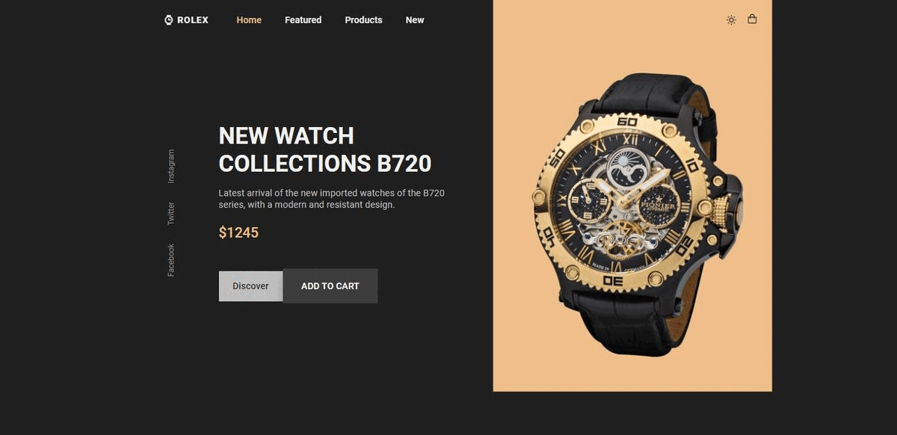

### Site de relógios responsivo

- Site de relógios responsivo usando - - HTML, CSS e JavaScript
- Rolagem suave em cada seção.
- Inclui um modo escuro e claro.
- Desenvolvido primeiro com a - - - -metodologia Mobile First, depois para - desktop.
- Compatível com todos os dispositivos - móveis e com uma interface de  - usuário -bonita e agradável.

## 🎨 Layout

### Ajustes e melhorias

O Projeto foi desenvolvido com as Tecnologia e voltadas nas seguintes Tarefas:

- [x] Criação do HTML
- [x] Criação do CSS
- [x] Criação do JAVASCRIPT

 🧑‍💻 Technologies e Tools I use:
 
 

 
 
 

  

### 🚀 Colaboradores

Agradecemos às seguintes pessoas que contribuíram para este projeto:

<table>
  <tr>
     <td align="center">
      <a href="#">
         
        
          <b>wanderson de farias</b>
        
        
      </a>
    </td>
  

